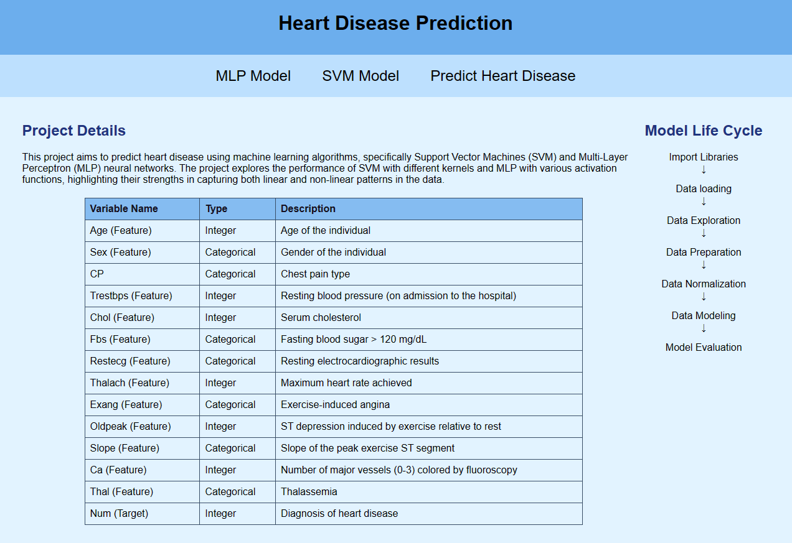
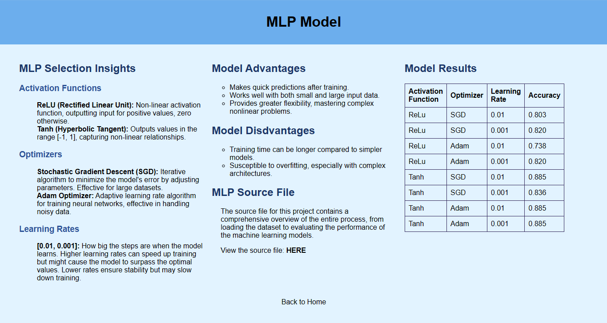
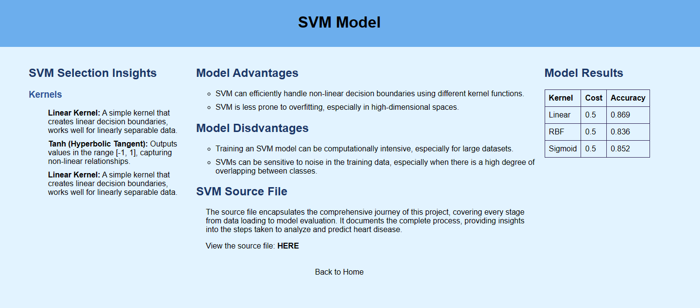
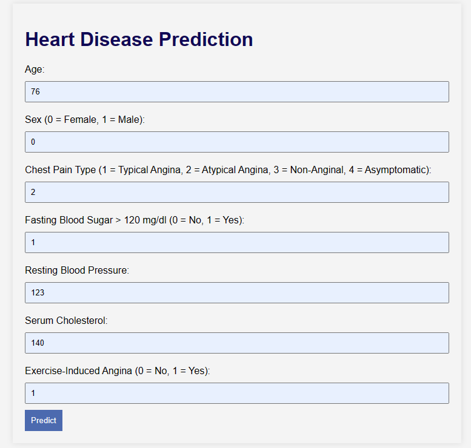

# AI-Project-Heart-Disease

## Overview
This project aims to predict heart disease using machine learning algorithms, specifically Support Vector Machines (SVM) and Multi-Layer Perceptron (MLP) neural networks. The project explores the performance of SVM with different kernels and MLP with various activation functions, highlighting their strengths in capturing both linear and non-linear patterns in the data.

## Features
The dataset comprises 13 features and 1 target variable. Below are the details and descriptions of each feature:

| Variable Name   | Type         | Description                                       |
|-----------|--------------|---------------------------------------------------------|
| Age       | Integer      | Age of the individual                                   |
| Sex       | Categorical  | Gender of the individual                                |      
| CP        | Categorical  | Chest pain type                                         | 
| Trestbps  | Integer      | Resting blood pressure (on admission to the hospital)   |
| Chol      | Integer      | Serum cholesterol                                       |
| Fbs       | Categorical  | Fasting blood sugar > 120 mg/dL                         | 
| Restecg   | Categorical  | Resting electrocardiographic results                    | 
| Thalach   | Integer      | Maximum heart rate achieved                             | 
| Exang     | Categorical  | Exercise-induced angina                                 | 
| Oldpeak   | Integer      | ST depression induced by exercise relative to rest      |    
| Slope     | Categorical  | Slope of the peak exercise ST segment                   |
| Ca        |Integer       | Number of major vessels (0-3) colored by fluoroscopy    |
| Thal      | Categorical  | Thalassemia                                             |
| Num       | Integer      | Diagnosis of heart disease  (TARGET)                    |

## Implementation Details
To train and test the models, the following libraries and tools were utilized:
* random &#8594; for generating random numbers
* pandas &#8594; for data manipulation and analysis
* numpy &#8594; for numerical operations
* scikit-learn &#8594; popular machine learning library that provides simple and efficient tools for data analysis, modeling, splitting

## Technologies Used
- Python
  - Flask Framework 
- HTML/CSS

## Usage Instructions
1. Clone the Repository:
   ```bash
   git clone https://github.com/jannazaman/AI-Project-Heart-Disease.git
   ```
2. Install Requirements:
   ```bash
   pip install -r requirements.txt
   ```
3. Run the Project:
   - PyCharm &rarr; Click the green "Run" button
   - Visual Studio Code &rarr; ``` bash python -m flask run ```
4. Access the App:
Once the application is running, you can access it in your web browser at the specified address (http://127.0.0.1:5000/).

## Model Application 
### Home Page

### MLP Details Page

### SVM Details Page

### Heart Disease Prediction Page


## Project Files
- venv/
  - *app.py:* Main Application File
  - templates/
    - *index.html:* Home Page
    - *mlp_model.html:* MLP model details page
    - *svm_model.html:* SVM model details page
    - *SVM.html:* SVM implementation notebook
    - *MLP.html:* MLP implementation notebook
    - *Predict_disease.html:* Heart disease prediction page
    - *mlp_predict.pkl:* Pickle file for MLP prediction (best model)
- *requirements.txt:* File specifying project dependencies
- images/: Folder containing Project Application Images
- *MLP.ipynb:* Jupyter Notebook file for MLP model implementation
- *SVM.ipynb:* Jupyter Notebook file for SVM model implementation
- *Report - MLP & SVM.pdf:* Detailed report on MLP and SVM models

## Model Evaluation and Insights
### Superior Performance of MLP with "tanh" Activation: 
Based on experiment outcomes, the MLP model with the "tanh" activation function outperformed both linear and non-linear SVM models, achieving the highest accuracy of 0.885. This indicates that the MLP model is a better fit for this dataset and its ability to simulate non-linear correlations contributes to capturing complex data patterns effectively.
   
### Model Advantages: 
- SVMs excel in handling high-dimensional and non-linearly separable data through kernel functions, offering insights into the decision-making process. 
- MLPs provide greater flexibility, mastering complex mappings. Careful hyperparameter selection is essential to avoid overfitting in MLP, while the symmetric "tanh" activation function aids in better data pattern understanding.

## Download Dataset
You can download the dataset (processed.cleveland.data) from the UCI Machine Learning Repository: https://archive.ics.uci.edu/ml/datasets/Heart+Disease
